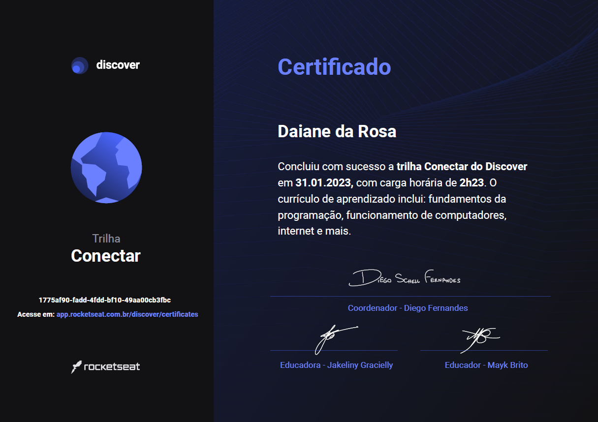

<h2 align="center">
   Discover Rocketseat 
</h2>

<h3 align="center">

   

🚧 Em andamento 🚧

</h3>

---

## 📚 Sobre

Criado pela <a href="https://rocketseat.com.br/" target="_blank">Rocketseat</a>, O Discover é um programa gratuito de formação de devs, feito para você aprender do zero programação com foco em desenvolvimento web.
Esse repositório foi feito para estudos/treinamentos das aulas dessa plataforma.

---

## Conectar
   Trilha de conhecimento para primeiro contato com a programação.

- Guia estelar de Programação ✅
- Computador, Software e Hardware ✅
- Internet, Roteadores e Servidores ✅
- Sistemas Operacionais ✅
- Linguagens de Programação ✅
- Tipos de aplicações web ✅

## 
  
## Fundamentar
   Trilha para aprender os fundamentos da programação web

- Ambiente Dev ✅
- Guia estelar de Css 🚧
- Nem tudo são Pixels 🚧
- Uma caixa dentro da outra 🚧
- Agora sim, cores 🚧
  - Cores 🚧
  - Background 🚧
- Posso ver e ouvir o HTML 🚧
  - Audio e Vídeo 🚧
  - Images 🚧
- Posicionando foguetes 🚧
- App bonito, até nos textos 🚧
  - Trabalhando com fontes 🚧
  - Mais estilos para os textos 🚧
- Formulários de outro planeta 🚧
  - Introdução ✅
  - Estrutura ✅
  - Tags de Entrada de Dados 🚧
  - Criando um formulário 🚧
- HTML que faz sentido, para todos ✅
- Nem só de classes ou IDs 🚧
  - Selectors and Combinators 🚧
  - Pseudo-classes 🚧
  - Pseudo-elements 🚧

